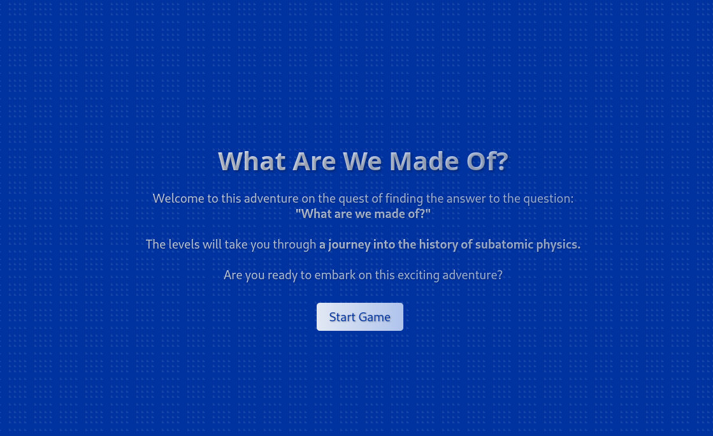
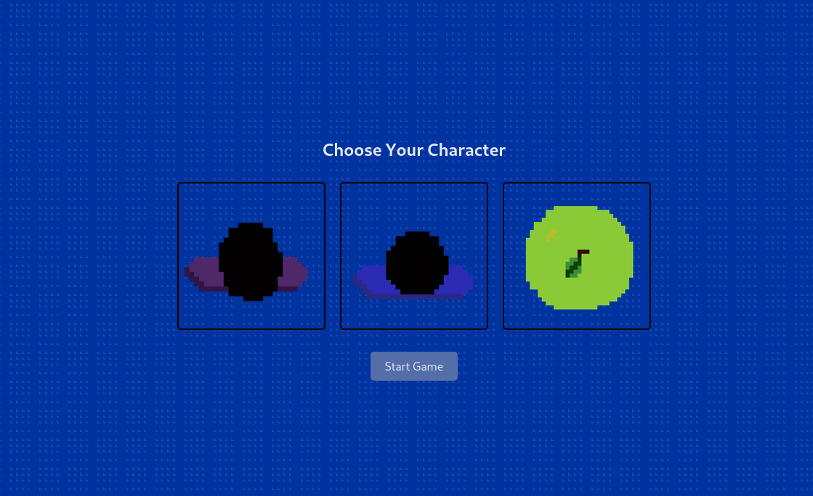
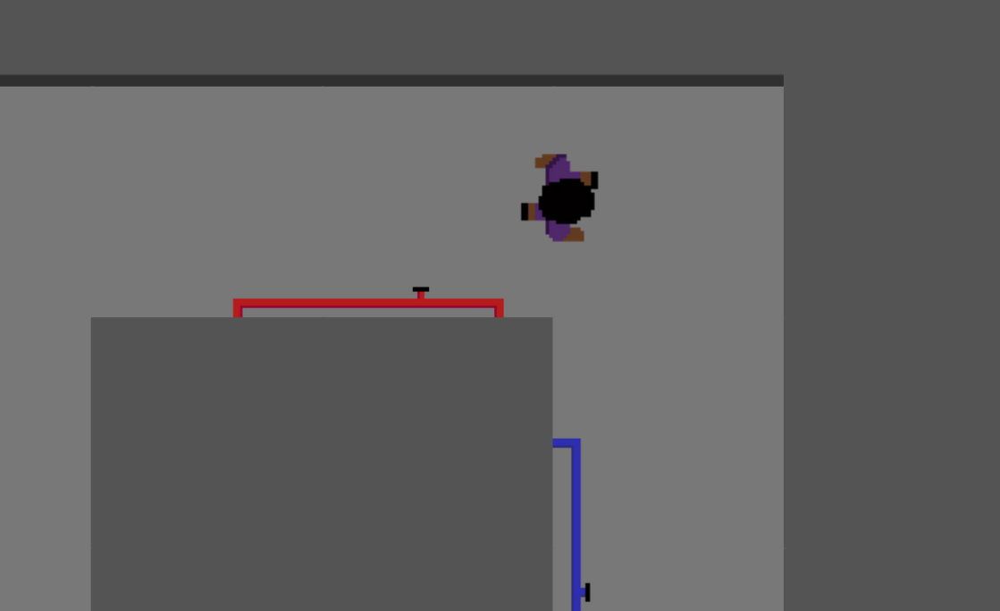
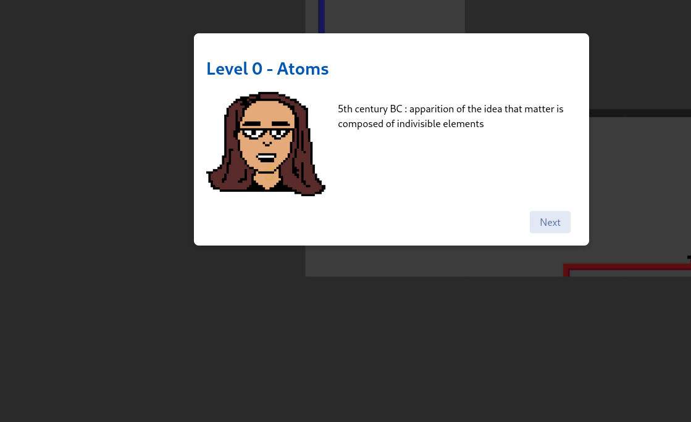
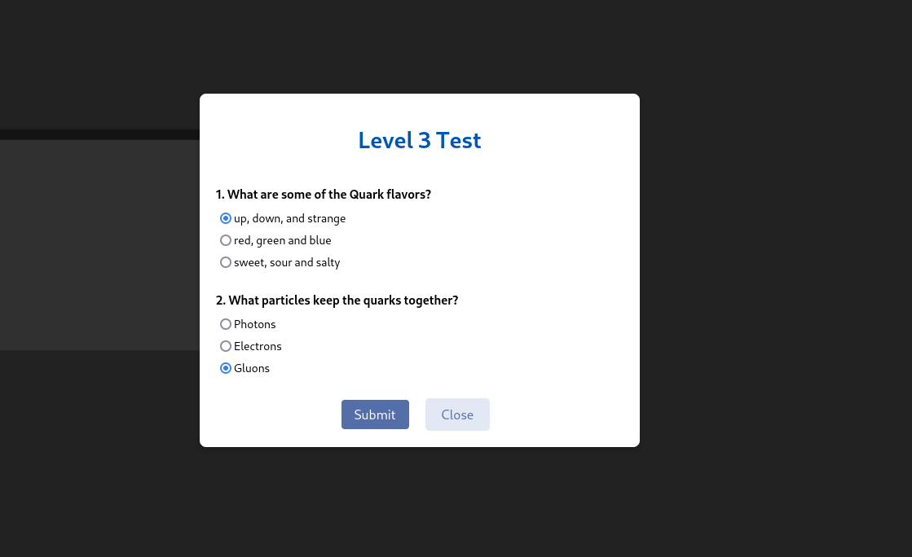
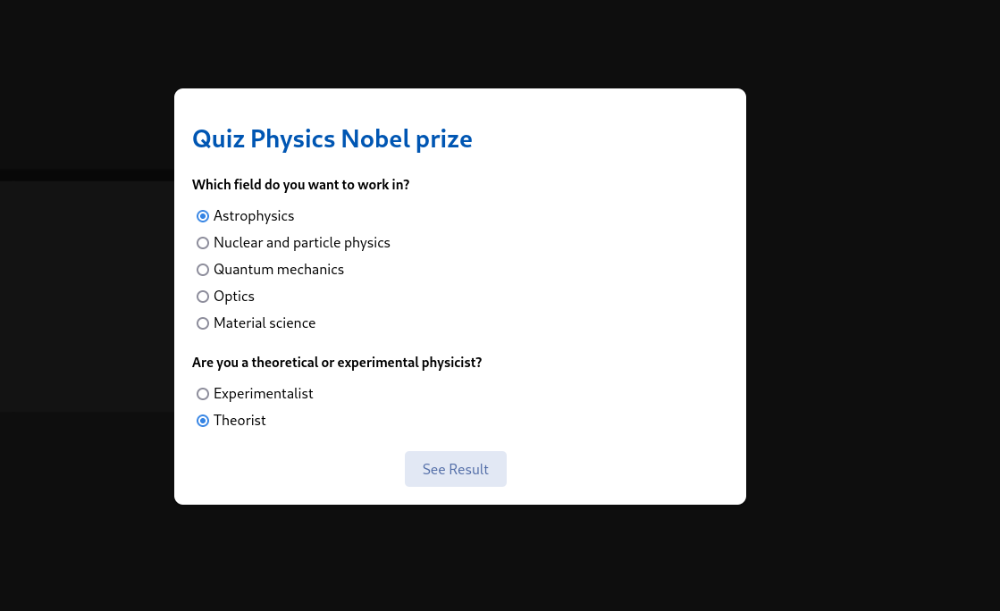
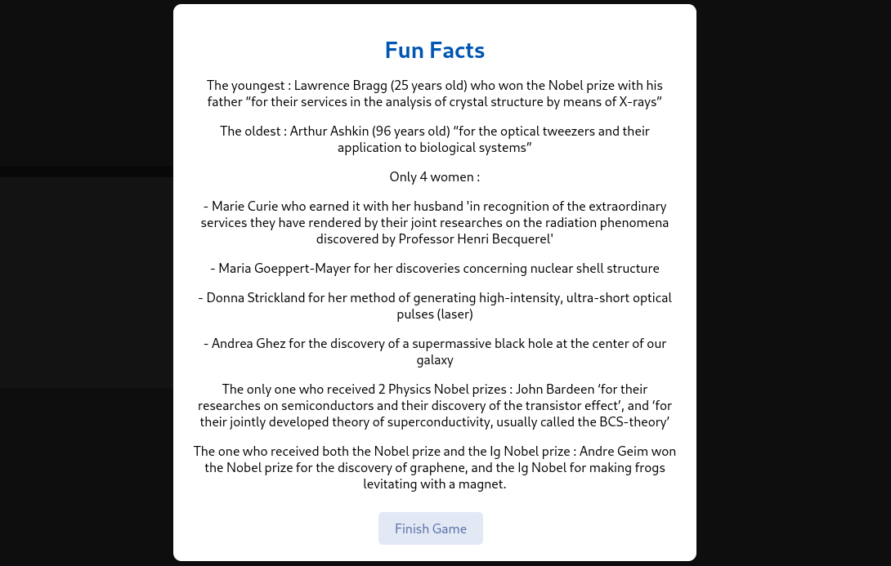
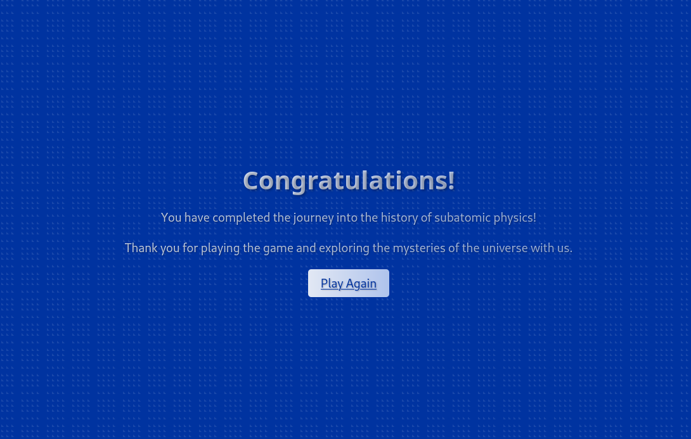

# CERN Hackathon Game - Journey into Subatomic Physics

🚀 **Explore the history of subatomic physics in this interactive game!**

Welcome to the CERN Hackathon Game - an interactive journey into the history of subatomic physics! This game takes you through 5 levels, each representing a different aspect of subatomic physics. Explore the CERN tunnels, interact with physicists, learn fascinating information, and answer quizzes to progress through the levels. At the end, discover the probability of winning a Nobel Prize based on your field of interest. The game also celebrates women in STEM with fun facts and achievements. 💡🎉

## 🛠️ Technologies Used

- React.js: A popular JavaScript library for building user interfaces.
- React Router: A tool for handling navigation and routing in a React application.
- SVG Graphics: Scalable Vector Graphics used to render the game elements.
- HTML and CSS: The foundation of the game's layout and design.
- Node.js: A JavaScript runtime environment for the backend.

## 🎮 How to Play

Visit the game at [cern-hackathon.vercel.app](https://cern-hackathon.vercel.app) and start playing right away!

  

## 🕹️ Game Instructions

1. Choose your player avatar: Select from a female player, male player, or an apple! 🚺🚹🍎
   

  

3. Explore the CERN tunnels: Use the arrow keys to move your player around the map. ⬆️⬇️⬅️➡️
   

  

4. Interact with physicists: Meet physicists throughout the levels to receive valuable information and hints about subatomic physics. 👩‍🔬🧪
   

  

5. Answer quizzes: At the end of each level, answer a quiz based on what you've learned from the physicist. 📝
   

  

6. Level Up: If you answer the quiz correctly, proceed to the next level and spawn in a different location in the CERN tunnels. 🆙
   
8. Discover your Nobel Prize probability: Input your field of interest at the end of the game to see the likelihood of winning a Nobel Prize. 🏆
   

  

8. Celebrate women in STEM: Enjoy fun facts and achievements highlighting the contributions of women in science, technology, engineering, and mathematics. 👩‍🔬🚀
   

  

9. Play again!
    

  

## 🤝 Contributions and Feedback

We welcome contributions and feedback from the community. If you find any issues, have suggestions for improvements, or want to collaborate, please feel free to create an issue or submit a pull request.

Enjoy the game and happy learning! 🎉
